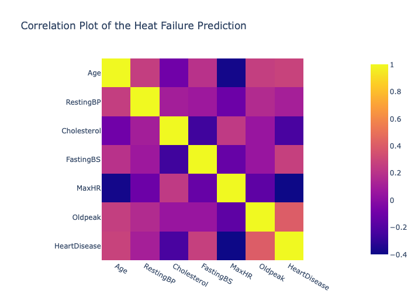
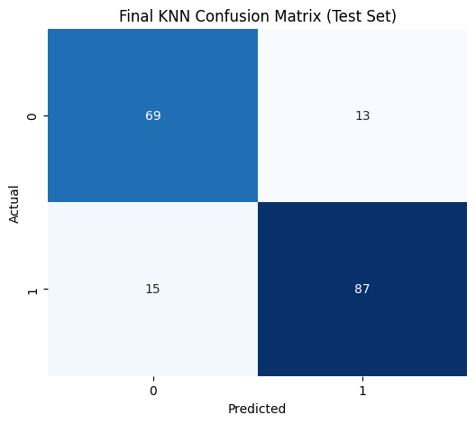

# Heart Disease Prediction ❤️🩺

## 📌 Background
Early detection of heart disease can help reduce severe outcomes.
This project applies machine learning to predict the risk of heart disease based on patient features.

---

## 📊 Dataset
Heart Failure Prediction dataset (Kaggle, FEDESORIANO)
918 records
11 features + 1 target (HeartDisease)
[Download from Kaggle](https://www.kaggle.com/fedesoriano/heart-failure-prediction)

⚠️ Note: Dataset is not included in this repository due to Kaggle’s license.
Please download it directly from Kaggle if you want to reproduce the results.

---

## 📂 Folder Structure
```
heart-disease-ml/
├── notebooks/       # Jupyter notebooks (EDA, training, evaluation)
├── models/          # Saved KNN model (knn_heart_disease.joblib)
├── data/            # Dataset CSV (not included, download from Kaggle)
├── images/          # Exported plots (EDA, ROC curve, etc.)
├── requirements.txt # Python libraries used
├── README.md

```
---

## 📈 Example Results

### 1. Correlation Heatmap


### 2. ROC Curve of KNN Model


### 3. Confusion Matrix of KNN Model


---

## 🤖 Models & Evaluation
| Model | F1-score | Precision | Recall |
|-------|---------|----------|-----------|
| KNN     | 0.8161     | 0.870      | 0.853   |

> For full details on exploratory data analysis, preprocessing, training, and evaluation, see the notebook in `notebooks/`.

---

## 🛠️ Usage
```python
from joblib import load

# Load trained model
knn_model = load("models/knn_heart_disease.joblib")

# Predict on new data
predictions = knn_model.predict(X_new)
```

---

## 📦 Dependencies
Required Python libraries are listed in `requirements.txt`.  
Install them using:

```bash
pip install -r requirements.txt
```
---

## 📝 Notes
- Interactive plots (e.g., correlation heatmap) are available on [Kaggle Notebook](https://www.kaggle.com/code/enfantksr/heartdisease-prediction)
